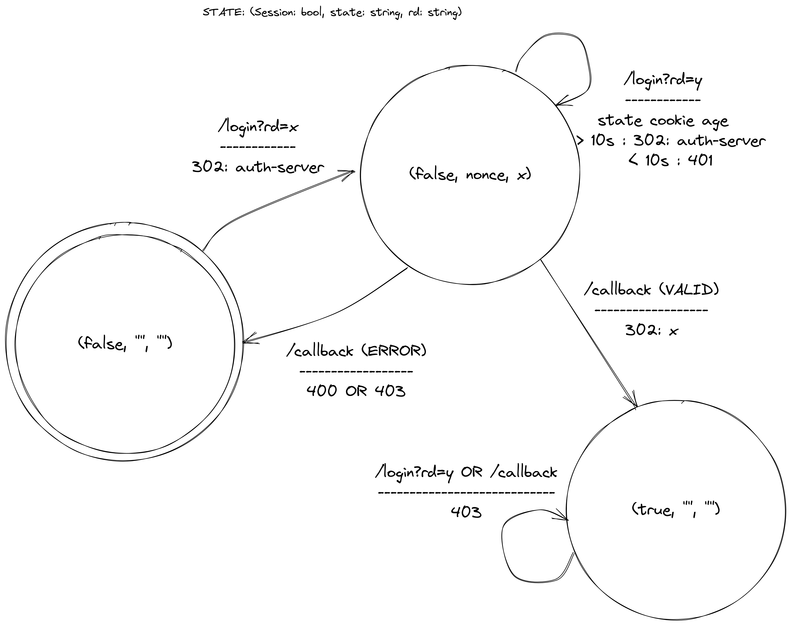

# oidc-auth

OIDC authentication for NGINX auth_request.

Inspired by [oauth2-proxy](https://github.com/oauth2-proxy/oauth2-proxy). Unlike oauth2-proxy it doesn't support proxy
mode. It's mainly intended to work with NGINX auth_request module.

## Environment Variables

| Name                 | Description                                                                                                                              | Default                     |
|----------------------|------------------------------------------------------------------------------------------------------------------------------------------|-----------------------------|
| ISSUER               | The OpenID issuer URL                                                                                                                    |                             |
| INSECURE_SKIP_VERIFY | Disable TLS certificate validation when connecting to the OpenID connect provider                                                        | false                       |
| SCOPES               | The OpenID connect scopes                                                                                                                | openid profile email groups |
| CLIENT_ID            | The client id                                                                                                                            |                             |
| CLIENT_SECRET        | The client secret                                                                                                                        |                             |
| PORT                 | The port the server will listen on                                                                                                       | 80 |
| HEADER_`NAME`        | Register the header `NAME` as a response header in /decisions endpoint. The value of the environment variables is a JMESPATH expression. |
| DEFAULT_HEADERS | Comma separated list of headers to return in the /decisions endpoint when the query parameter `headers=` is not available                |  |

## State machine



## Endpoints

- /auth/login
- /auth/logout
- /auth/callback
- /auth/decisions[?allowed_groups=...&allowed_emails=...&headers=]

## ingress-nginx

The Ingress for the service you are trying to secure:

```yaml
apiVersion: networking.k8s.io/v1
kind: Ingress
metadata:
  namespace: http-bin
  name: http-bin
  annotations:
    nginx.ingress.kubernetes.io/auth-response-headers: Authorization,X-Auth-Request-User,X-Auth-Request-Subject,X-Auth-Request-Preferred-Username,X-Auth-Request-Groups,X-Auth-Request-Email
    nginx.ingress.kubernetes.io/auth-url: "https://$host/auth/decisions"
    nginx.ingress.kubernetes.io/auth-signin: "https://$host/auth/login"
    nginx.ingress.kubernetes.io/auth-always-set-cookie: "true"
spec:
  ingressClassName: nginx
  tls:
    - hosts: [ "http-bin.test" ]
  rules:
    - host: oauth-bin.test
      http:
        paths:
          - pathType: Prefix
            path: "/"
            backend:
              service:
                name: http-bin
                port:
                  name: http
```

A corresponding Ingress for the `/auth` URL in the same namespace `oidc-auth` is deployed in:

```yaml
apiVersion: networking.k8s.io/v1
kind: Ingress
metadata:
  namespace: oidc-auth
  name: http-bin-auth
spec:
  ingressClassName: nginx
  tls:
    - hosts: [ "http-bin.test" ]
  rules:
    - host: http-bin.test
      http:
        paths:
          - pathType: Prefix
            path: /auth
            backend:
              service:
                name: oidc-auth
                port:
                  number: 80
```

## JMESPATH
You can use JMESPATH to define a transformation from an ID token to an HTTP header.
The entire ID token will be passed to JMESPATH when evaluating the expression in the environment variables with the prefix `HEADER_`.
In addition, the raw token in it's encoded form will be passed as `raw`.

Example headers:
```bash
HEADER_Authorization=join(' ', ['Bearer', raw])
HEADER_X-Auth-Request-User=name
```

When a request is sent to `/decisions?headers=Authorization,Auth-Request-User=name`, the headers
`Authorization` and `X-Auth-Request-User` will contain the ID token and the value of the `name` claim, respectively.

## Decisions endpoint

The NGINX auth_request module will use the /decisions endpoint to authenticate the request. The following query parameters are available:
- allowed_emails : Comma seperated list of emails. If the `email` claim value is in the list the request will be allowed. 
- allowed_groups : Comma seperated list of groups. If any value in the `groups` claim in the list the request will be allowed. 
- headers : Comma separated list of headers that will be returned. The header must be registered using the environment variable prefix `HEADER_`.

## Deploy

Use `kustomize` to create the Deployment and the Service. You will have to create the Secret `oidc-auth` with all the
environment variables.
